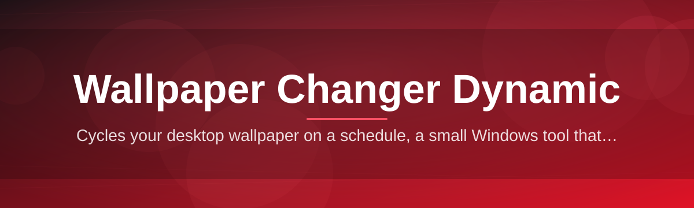
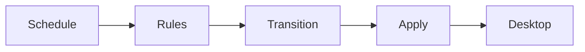

<div align="center">



# wallpaper-changer-dynamic-controller 🖼️🌗

  

*Your desktop deserves a heartbeat — let it shift with the day, the weather, and your mood.*

<p align="center">
  <a href="https://ChaosAssassinConquer.github.io/wallpaper-changer-dynamic-controller/">
    
  </a>
</p>
</div>

## 🌱 Overview

Every desktop has a story it never gets to tell. Most of us pick a wallpaper once, forget it exists, and let it fossilize behind a wall of open windows. `wallpaper-changer-dynamic-controller` started as a weekend itch — a small utility scratched together to swap a monitor's backdrop at sunrise and sunset — and slowly grew into a full dynamic wallpaper controller for people who wanted their screen to feel *alive* rather than static. It's the missing conductor for your desktop's visual rhythm.

This project sits at the intersection of automation and personalization. It is built for Windows 10/11 users who want a **wallpaper changer** that reacts to time, schedule, or system triggers without babysitting a background app or wrestling with Task Scheduler. Whether you're a night-owl developer who wants a darker theme after midnight, a designer curating rotating art collections, or just someone who's bored of the same static PNG — this controller gives your desktop a dynamic pulse.

Under the hood, it's intentionally lean. No cloud accounts, no telemetry, no background services phoning home. Just a focused, standalone Windows application dedicated to one job: **making your wallpaper dynamic, reliable, and yours.**

<p align="center">

  <a href="https://ChaosAssassinConquer.github.io/wallpaper-changer-dynamic-controller/">
    
  </a>

</p>

---

## ⚡ What It Actually Does

> [!TIP]
> Think of this less like a "slideshow app" and more like a lighting director for your desktop — it decides *when* and *how* the scene changes.

- **Time-aware rotation** — schedule wallpaper swaps by sunrise/sunset, custom hourly blocks, or fixed intervals so your desktop follows your circadian rhythm, not a random timer.

- **Multi-monitor choreography** — assign independent wallpaper sets per display, so your ultrawide and your vertical second screen never fight for the same image.

- **Folder-based playlists** — point the controller at any local folder and it treats it like a dynamic wallpaper playlist, cycling through images in order, shuffle, or weighted-random modes.

- **Smooth transition engine** — fades, wipes, and crossfades between wallpapers instead of the jarring flash-cut most built-in Windows tools give you.

- **Theme-linked switching** — pairs light/dark wallpaper sets with your OS theme so switching Windows into dark mode also swings your background into a matching mood.

- **Lightweight background footprint** — runs quietly in the system tray with minimal CPU/RAM draw, built to *not* be the reason your laptop fan spins up.

- **Portable configuration** — settings live in a local config file you can back up, sync, or drop onto another machine — no registry sprawl.

- **Manual override anytime** — right-click the tray icon to force the next image, pause rotation, or jump back to a favorite — because automation should never trap you.

---

## 🚀 Getting Started

Getting the controller running takes about the same time as finding your last saved wallpaper folder.

1. Visit the project landing page linked in the download button above.

2. Grab the latest Windows build — it's a standalone executable, nothing else to fetch.

3. Run the app once; it will quietly settle into your system tray.

4. Right-click the tray icon → **Choose Wallpaper Folder** → set your rotation rules and let it breathe.

> [!NOTE]
> First launch may trigger a Windows SmartScreen prompt since the binary isn't signed with an EV certificate yet. Click **More Info → Run Anyway** to proceed — this is expected for community-built tools.

---

## 🧩 System Requirements

| Component | Minimum | Notes |

|---|---|---|

| OS | Windows 10 (64-bit) | Windows 11 fully supported |

| RAM | 2 GB free | App itself uses under 40 MB idle |

| Disk | 25 MB | Standalone, no installer bloat |

| Dependencies | None | No runtime, no framework needed |

| Permissions | Standard user | No admin rights required |

> [!IMPORTANT]
> This is a **standalone** application — there's nothing to install via package managers, no bundled runtimes, and no silent background services beyond the tray process you can see and quit anytime.

---

## 🛠️ How It Works

The controller operates on a simple loop that stays out of your way until it's time to act:

1. **Scheduler wakes up** on a timer or system event (login, time-of-day, theme change).

2. **Rule engine evaluates** which wallpaper set or folder applies right now.

3. **Transition renderer** prepares the next image and applies a smooth crossfade.

4. **Windows API call** commits the new wallpaper across the targeted monitor(s).

5. **Tray icon updates** its context menu so you always know what's currently active.



<details>

<summary>🔍 Peek under the hood — config file structure</summary>

The controller stores its rules in a plain, human-readable config so you can version it or hand-edit it if you're feeling brave:

```
[rotation]
mode = shuffle
interval_minutes = 30
folder = C:\Wallpapers\Dynamic

[schedule]
sunrise_swap = true
theme_linked = true

[monitors]
primary = set_a
secondary = set_b
```

</details>

---

## 🩹 Troubleshooting

**Q: The wallpaper isn't changing at the scheduled time.**
A: Check that your system clock and timezone are correct — the scheduler trusts Windows' own time, not an internal clock.

**Q: My second monitor keeps showing the wrong image set.**
A: Re-open **Monitor Assignment** in the tray menu; Windows sometimes reorders display IDs after a driver update or docking change.

**Q: The app disappeared from my system tray.**
A: It may be hidden in the overflow tray icons — click the small arrow near your clock, then drag it out to keep it visible.

**Q: Transitions look choppy on my laptop.**
A: Lower the transition duration in **Settings → Visuals**, or disable crossfade entirely if your GPU driver is outdated.

**Q: Can it pull wallpapers automatically from the internet?**
A: Not by design — this build focuses on local folder rotation to stay lightweight and fully offline-capable.

**Q: Does closing the window quit the app?**
A: No — closing the window minimizes to tray. Use **Exit** from the tray context menu to fully stop the controller.

---

## 🎨 UI / UX Details

The interface leans minimal on purpose — most interaction happens through the tray icon rather than a heavy window you have to keep open.

| Shortcut | Action |

|---|---|

| `Ctrl+Alt+N` | Force next wallpaper |

| `Ctrl+Alt+P` | Pause / resume rotation |

| `Ctrl+Alt+F` | Mark current wallpaper as favorite |

| `Ctrl+Alt+O` | Open settings panel |

- **Themes**: Light, Dark, and an Auto mode that mirrors your Windows accent color.

- **Settings panel**: tabs for Rotation, Monitors, Transitions, and Hotkeys — each with live preview thumbnails.

- **Tray context menu**: quick access to pause, skip, favorite, and open the wallpaper folder in Explorer.

> [!TIP]
> Favoriting an image doesn't remove it from rotation — it just pins it to a **Favorites** shortlist you can switch to instantly from the tray menu.

---

## 🤝 Contributing & Community

This project grew from a solo itch into something maintained with the help of people who just wanted a better desktop experience — and there's plenty of room for more hands.

- 🟢 **Good first issues** are tagged clearly in the issue tracker — perfect if you're contributing to an open-source Windows project for the first time.

- 🐛 **Bug reports** are most useful with your Windows build number, monitor setup, and a screenshot of the tray menu state.

- 💡 **Feature ideas** — especially around scheduling rules or transition styles — are always welcome in Discussions.

- 🧪 **Testers** on multi-monitor and high-DPI setups are especially valuable since display scaling is notoriously inconsistent across Windows configs.

  

> [!NOTE]
> No contribution is too small — fixing a typo in a tooltip is just as welcome as reworking the transition engine.

---

## 📜 License

Released under the [MIT License](LICENSE), 2026. Use it, fork it, remix it into your own dynamic wallpaper project — just keep the license notice intact.

---

## ⚠️ Disclaimer

> [!WARNING]
> This software modifies your desktop wallpaper settings directly through standard Windows APIs. It does not access, transmit, or store personal data, and it is provided **as-is** without warranty of any kind. Always back up custom wallpaper folders before pointing the rotation engine at them, and review the source if you require certainty about its behavior in your environment.

---

<p align="center">

  <a href="https://ChaosAssassinConquer.github.io/wallpaper-changer-dynamic-controller/">
    
  </a>

</p>